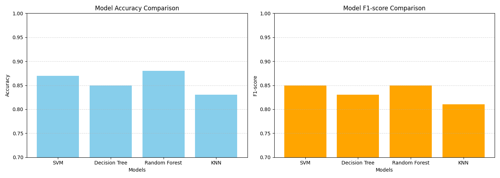

# Student Performance Analysis – 1st Task

This project analyzes students' performance based on various socio-economic and demographic factors using Python and Machine Learning models.

## Project Overview

This notebook includes:
- Data exploration and preprocessing
- Visualizations using `matplotlib` and `seaborn`
- Comparison of classification models based on student exam scores
- Accuracy comparison and Confusion Matrix visualization for:
  - SVM
  - Random Forest
  - Decision Tree
  - K-Nearest Neighbour

---

## Problem Statement

Understand how different factors, such as:
- Gender
- Parental level of education
- Lunch type
- Test preparation

affect students' **math**, **reading**, and **writing** scores.

---

## Models Used

| Model                | Accuracy |
|---------------------|----------|
| SVM Classifier       | 87.00%   |
| Random Forest Classifier | 88.00%   |
| Decision Tree Classifier | 85.00%   |
| K-Nearest Neighbour  | 83.00%   |

---

## Visualizations

-  Boxplots: Scores vs Parental Education
-  Bar Plots: Accuracy Comparison
-  Combined Confusion Matrix Chart for All Models

---
## Model Visualization




## Dataset

Dataset used:  
 `StudentsPerformance.csv`  
Available in Kaggle Datasets or provided in the repository.

---

## Libraries Used

```bash
pandas
numpy
matplotlib
seaborn
scikit-learn
